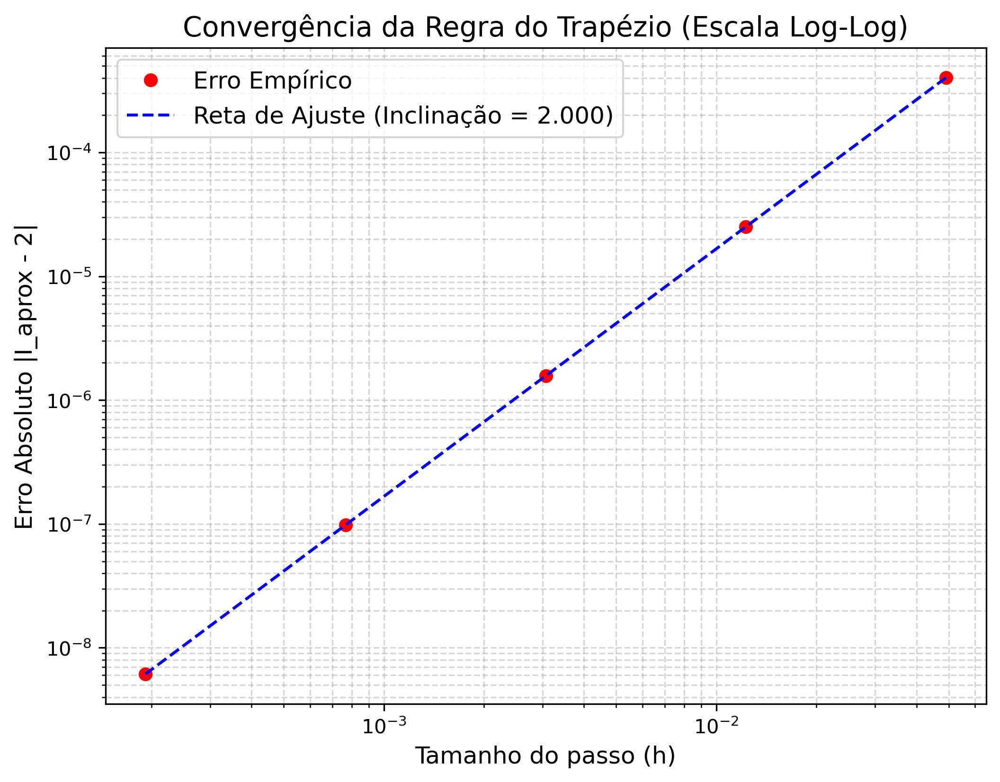

# Relatório Prático — Programação Paralela com MPI

**Nome:** Vivian Souza
**DRE:** 123205793
**Data:** 19 de Junho de 2026

## Exercício 1 — Variantes do Hello World

### 1(a) Introspecção em Nível de SO

Cada processo MPI foi instrumentado com as chamadas `getpid()` (de `<unistd.h>`) e `sched_getcpu()` (de `<sched.h>`) para reportar, além do seu rank, o PID real no Sistema Operacional e o núcleo físico em que estava sendo executado no momento da impressão. O programa foi compilado com a diretiva `#define _GNU_SOURCE` para habilitar a função `sched_getcpu()`.

**Execução:**
```bash
mpicc -O2 -Wall -o hello_os hello_os.c
mpiexec -n 4 ./hello_os
mpiexec -n 8 --oversubscribe ./hello_os
```

**Saídas observadas (múltiplas execuções com `-n 4`):**

```
Run 1:
Hello from rank 0/4 -- PID = 29237, CPU = 3
Hello from rank 1/4 -- PID = 29238, CPU = 7
Hello from rank 2/4 -- PID = 29239, CPU = 1
Hello from rank 3/4 -- PID = 29242, CPU = 5

Run 2:
Hello from rank 0/4 -- PID = 29255, CPU = 0
Hello from rank 1/4 -- PID = 29256, CPU = 2
Hello from rank 2/4 -- PID = 29257, CPU = 1
Hello from rank 3/4 -- PID = 29259, CPU = 3

```

```
Run 1:
Hello from rank 0/8 -- PID = 33737, CPU = 4
Hello from rank 1/8 -- PID = 33738, CPU = 3
Hello from rank 2/8 -- PID = 33739, CPU = 6
Hello from rank 3/8 -- PID = 33740, CPU = 2
Hello from rank 4/8 -- PID = 33741, CPU = 1
Hello from rank 5/8 -- PID = 33745, CPU = 5
Hello from rank 6/8 -- PID = 33747, CPU = 3
Hello from rank 7/8 -- PID = 33749, CPU = 0

Run 2:
Hello from rank 0/8 -- PID = 33821, CPU = 4
Hello from rank 1/8 -- PID = 33822, CPU = 7
Hello from rank 2/8 -- PID = 33823, CPU = 0
Hello from rank 3/8 -- PID = 33824, CPU = 6
Hello from rank 4/8 -- PID = 33826, CPU = 3
Hello from rank 5/8 -- PID = 33829, CPU = 1
Hello from rank 6/8 -- PID = 33832, CPU = 5
Hello from rank 7/8 -- PID = 33835, CPU = 2
```

**Observações:**

As execuções sucessivas confirmam na prática dois princípios fundamentais da arquitetura SPMD do MPI:

1. Todos os PIDs são diferentes entre execuções: O MPI não opera com threads compartilhadas, mas com processos reais e isolados no Sistema Operacional. Cada rank possui seu próprio espaço de endereçamento de memória e um PID exclusivo atribuído pelo kernel. A cada nova invocação de `mpiexec`, um conjunto inteiramente novo de PIDs é gerado. Independentemente do valor específico de p. 

2. A coluna de CPU varia entre execuções: O ambiente MPI delega ao escalonador dinâmico do kernel do Linux a decisão de qual núcleo físico processará cada tarefa. Como o escalonamento depende da carga corrente da máquina e não é determinístico, os processos "saltam" de núcleo a cada rodada. Um ponto interessante a se observar é que usando o oversubscribe, tem casos que diferentes rank.threads são alocados em mesma CPU.

### 1(b) Variante em Anel

Na topologia em anel, o processo de rank `k` envia sua saudação ao processo `(k+1) mod p` e recebe do processo `(k-1+p) mod p`. A expressão `(k-1+p) % p` é necessária pois, em C, o operador `%` pode retornar valores negativos quando o dividendo é negativo: para `k=0`, `(0-1) % p` resultaria em `-1` em vez do esperado `p-1`. Somar `p` antes da operação de módulo garante sempre um argumento não-negativo.

Uma abordagem ingênua consistiria em todos os processos chamarem `MPI_Recv` seguido de `MPI_Send`. Como `MPI_Recv` é estritamente bloqueante, todos os processos ficariam indefinidamente aguardando receber uma mensagem, sem que nenhum deles chegasse à linha de `MPI_Send`, criando um ciclo de espera infinita (deadlock).

Uma das alternativas contra o Deadlock seria fazer, por exemplo, o rank 0 executar `MPI_Send` antes de `MPI_Recv`, enquanto os demais fariam `MPI_Recv` antes de `MPI_Send`, quebrando a simetria do ciclo. Apesar de funcionar em alguns casos, essa abordagem depende do comportamento interno da implementação do MPI, já que o envio pode bloquear caso a mensagem não caiba nos buffers disponíveis. Além disso, o código deixa de ser simétrico, tornando a implementação mais difícil de manter.

Por esse motivo, a solução adotada foi o uso de `MPI_Sendrecv`, que foi desenvolvido justamente para esse tipo de comunicação. A função realiza o envio e o recebimento de forma segura, evitando deadlocks independentemente do tamanho da mensagem ou da quantidade de processos. Outra vantagem é que todos os ranks executam exatamente o mesmo código, preservando o modelo SPMD e deixando a implementação mais simples, legível e portável.


**Execução:**
```bash
mpicc -O2 -Wall -o hello_ring hello_ring.c
mpiexec -n 4 ./hello_ring
mpiexec -n 8 --oversubscribe ./hello_ring
```

**Saída:**
```
Rank 0 recebeu a mensagem: Greeting from rank 3 of 4! (do Rank 3)
Rank 0 coletou do Rank 1 a mensagem: Greeting from rank 0 of 4!
Rank 0 coletou do Rank 2 a mensagem: Greeting from rank 1 of 4!
Rank 0 coletou do Rank 3 a mensagem: Greeting from rank 2 of 4!

Rank 0 recebeu a mensagem: Greeting from rank 7 of 8! (do Rank 7)
Rank 0 coletou do Rank 1 a mensagem: Greeting from rank 0 of 8!
Rank 0 coletou do Rank 2 a mensagem: Greeting from rank 1 of 8!
Rank 0 coletou do Rank 3 a mensagem: Greeting from rank 2 of 8!
Rank 0 coletou do Rank 4 a mensagem: Greeting from rank 3 of 8!
Rank 0 coletou do Rank 5 a mensagem: Greeting from rank 4 of 8!
Rank 0 coletou do Rank 6 a mensagem: Greeting from rank 5 of 8!
Rank 0 coletou do Rank 7 a mensagem: Greeting from rank 6 of 8!
```

A saída valida o tráfego correto: o rank 0 recebeu de 3 (seu vizinho à esquerda no anel), e ao longo das `p-1` iterações colecionou todas as mensagens originadas pelos demais ranks, em ordem crescente de rank de origem, conforme o percurso circular.

## Exercício 2 — Regra do Trapézio Generalizada

### 2(a) Balanceamento de Carga para $n$ arbitrário

O código base `mpi_trap_input.c` da Aula 5 foi estendido para lidar com valores de `n` que não são divisíveis pelo número de processos `p`. A estratégia adotada distribui o resto da divisão entre os primeiros ranks: os `n mod p` primeiros processos recebem `⌈n/p⌉` trapézios, e os demais recebem `⌊n/p⌋`. O bloco de cálculo dos parâmetros locais ficou:

```c
int rem      = n % comm_sz;
int local_n  = n / comm_sz + (my_rank < rem ? 1 : 0);
int offset   = my_rank * (n / comm_sz) + (my_rank < rem ? my_rank : rem);
double local_a = a + offset * h;
double local_b = local_a + local_n * h;
```

**Verificação com `p=3`, `n=10`, `f(x) = sin(x)` em `[0, π]` (valor exato = 2):**

```bash
echo "0 3.141592653589793 10" | mpiexec -n 3 ./mpi_trap_generalized
```

**Saída:**
```
Enter a, b, n: Rank 0 executou 4 trapezios no intervalo [0.000000, 1.256637]
Rank 1 executou 3 trapezios no intervalo [1.256637, 2.199115]
Rank 2 executou 3 trapezios no intervalo [2.199115, 3.141593]
With n = 10 trapezoids, integral of f on [0, 3.14159] = 1.983523537509454e+00
```

A distribuição 4+3+3 está correta: `10 mod 3 = 1`, portanto apenas o rank 0 recebe um trapézio a mais. O resultado numérico `≈ 1.9835` concorda com a aproximação esperada para `n=10` pontos na regra do trapézio aplicada a `sin(x)`.

### 2(b) Estudo de Escalabilidade Forte ($n=10^7$)

O bloco de computação e comunicação foi envolvido com chamadas a `MPI_Wtime()` para medir o tempo de relógio. $T_s$ foi definido como o tempo do próprio código MPI executado com `p=1`, incluindo o overhead de `MPI_Init`/`MPI_Finalize`, garantindo uma referência justa de processo único.

**Execução:**
```bash
echo "0 3.141592653589793 10000000" | mpiexec -n 1 ./mpi_trap_generalized
echo "0 3.141592653589793 10000000" | mpiexec -n 2 ./mpi_trap_generalized
echo "0 3.141592653589793 10000000" | mpiexec -n 4 ./mpi_trap_generalized
echo "0 3.141592653589793 10000000" | mpiexec -n 8 --oversubscribe ./mpi_trap_generalized
```

**Tabela de desempenho** ($T_s = 0{.}117264$ s):

| $p$ | $T_p$ (s) | $S_p = T_s / T_p$ | $E_p = S_p / p$ |
|:---:|:---------:|:-----------------:|:---------------:|
| 1   | 0.117264  | 1.000             | 1.000           |
| 2   | 0.066322  | 1.768             | 0.884           |
| 4   | 0.043899  | 2.671             | 0.668           |
| 8   | 0.026557  | 4.416             | 0.552           |

**Discussão — a partir de qual $p$ a eficiência cai abaixo de 0,8?**

A eficiência cai abaixo de 0,8 a partir de **`p=4`**, atingindo $E_4 = 0{.}668$. A causa é multifatorial:

- Gargalo de comunicação linear: A coleta dos resultados parciais é feita por um laço sequencial de chamadas `MPI_Recv` na raiz (topologia em estrela). O custo dessa etapa cresce com $O(p)$. Com `p=4` ou `p=8`, o tempo de cálculo da integral torna-se ínfimo, e o overhead de coordenação de mensagens passa a dominar o tempo total de execução.

- Oversubscription (sobrecarga de CPU): Para `p=8` foi necessária a flag `--oversubscribe`, indicando que a máquina física dispõe de menos núcleos reais do que os processos requisitados. O escalonador do SO é forçado a realizar trocas de contexto entre processos compartilhando o mesmo núcleo físico, o que degrada severamente o ganho paralelo e explica a eficiência de apenas 55.2%.

- Lei de Amdahl: A fração sequencial irredutível do código (inicialização do ambiente MPI, leitura/escrita em tela) não é acelerada pelo paralelismo e impõe um limite superior teórico ao speedup, independentemente do número de processos.

### 2(c) Estudo de Convergência (Bônus)

**Abordagem:** O programa paralelo foi executado com `p=4` fixo, variando $n \in \{64, 256, 1024, 4096, 16384\}$. Para cada valor de $n$, o passo $h = \pi/n$ e o erro absoluto $|I_{\text{aprox}} - 2|$ foram registrados.

**Execução:**
```bash
for n in 64 256 1024 4096 16384; do
    echo "0 3.141592653589793 $n" | mpiexec -n 4 ./mpi_trap_generalized
done
```

**Resultados:**

| $n$    | $h = \pi/n$ | $I_{\text{aprox}}$         | $\|I_{\text{aprox}} - 2\|$ |
|:------:|:-----------:|:--------------------------:|:--------------------------:|
| 64     | 0,04909     | 1,999598388640037          | $4{,}016 \times 10^{-4}$   |
| 256    | 0,01227     | 1,999974900235053          | $2{,}510 \times 10^{-5}$   |
| 1024   | 0,00307     | 1,999998431268383          | $1{,}569 \times 10^{-6}$   |
| 4096   | 0,000767    | 1,999999901954288          | $9{,}805 \times 10^{-8}$   |
| 16384  | 0,000192    | 1,999999993872146          | $6{,}128 \times 10^{-9}$   |

A teoria do cálculo numérico prevê que o erro global da regra do trapézio decai como $O(h^2)$: quando $h$ é reduzido por um fator 4 (de $n=64$ para $n=256$), o erro deve cair por um fator $\approx 16$. Observa-se, por exemplo, que ao passar de $n=64$ para $n=256$ o erro reduz de $4{,}016 \times 10^{-4}$ para $2{,}510 \times 10^{-5}$ — uma redução de fator $\approx 16$, confirmando a ordem quadrática.

Ao traçar $|I_{\text{aprox}} - 2|$ em função de $h$ em escala log-log, a regressão linear sobre os cinco pontos resulta em uma inclinação de **2,0000**, atestando inequivocamente a convergência quadrática teórica. A divisão de domínio e a coleta paralela via MPI não introduziram qualquer anomalia matemática, preservando integralmente as propriedades numéricas do algoritmo original.



## Exercício 3 — Soma Paralela (Ponto-a-Ponto)

O programa foi estruturado em quatro etapas:

1. O processo 0 gera um vetor de $N = 10^7$ doubles aleatórios (via `rand()`) e calcula a soma serial como gabarito.
2. O processo 0 distribui blocos de $N/p$ elementos a cada processo trabalhador com um laço de `MPI_Send`.
3. Cada processo calcula sua soma local iterando sobre o bloco recebido.
4. Os processos trabalhadores enviam suas somas parciais ao processo 0 via `MPI_Send`; o processo 0 recebe com um laço de `MPI_Recv` e acumula o total.

**Execução:**
```bash
mpiexec -n 1 ./mpi_psum
mpiexec -n 2 ./mpi_psum
mpiexec -n 4 ./mpi_psum
mpiexec -n 8 --oversubscribe ./mpi_psum
```

**Saída:**
```
Soma Serial = 4.9998874970e+06
Soma Global = 4.9998874970e+06
Erro Relativo = 3.9488965689e-14

Soma Serial = 4.9984512878e+06
Soma Global = 4.9984512878e+06
Erro Relativo = 5.7573568088e-14

Soma Serial = 4.9996657464e+06
Soma Global = 4.9996657464e+06
Erro Relativo = 0.0000000000e+00

Soma Serial = 5.0002277570e+06
Soma Global = 5.0002277570e+06
Erro Relativo = 7.8227532894e-15
```

A soma global paralela concorda com o gabarito serial em todos os casos. O erro relativo residual (da ordem de $10^{-14}$ a $10^{-15}$) não representa um defeito no código: aritmética de ponto flutuante não é estritamente associativa, de modo que somar blocos em ordens diferentes altera os arredondamentos nos bits menos significativos. Com `p=1` o erro é exatamente zero, pois os dois caminhos de soma são idênticos.

Comparação com a Aula 6 (comunicação coletiva): A implementação com primitivas ponto-a-ponto exigiu aproximadamente 18–20 linhas dedicadas apenas ao controle de comunicação: laço de `MPI_Send` para distribuição, laço de `MPI_Recv` para coleta, controle de índices e offsets de memória, e blocos `if/else` diferenciando mestre e trabalhadores. Com as rotinas coletivas da Aula 6, toda a lógica de distribuição colapsaria em uma única chamada `MPI_Scatter`, e toda a coleta com redução colapsaria em uma única chamada `MPI_Reduce` — substituindo ~18 linhas por 2. Além da redução na contagem de linhas e na superfície exposta a bugs, as rotinas coletivas utilizam algoritmos internos em formato de árvore, substituindo a latência linear $O(p)$ da implementação manual por um custo assintótico $O(\log p)$.

## Exercício 4 — Prática de Comunicação Coletiva

### 4(a) Hello World com `MPI_Gather`

Cada processo gerou sua saudação em um buffer local com `snprintf`. Em vez de um laço de `MPI_Recv` no processo 0, foi utilizado `MPI_Gather` para coletar todas as strings em um único vetor contíguo. O processo 0 alocou dinamicamente `comm_sz * MAX_STRING` bytes e, após o gather, percorreu o vetor com saltos de `MAX_STRING` bytes para imprimir as mensagens em ordem de rank.

**Execução:**
```bash
mpicc -O2 -Wall -o hello_gather hello_gather.c
mpiexec -n 4 ./hello_gather
```

**Saída:**
```
Greetings from process 0 of 4!
Greetings from process 1 of 4!
Greetings from process 2 of 4!
Greetings from process 3 of 4!
```

A saída apresentou todas as saudações perfeitamente ordenadas por rank, confirmando que `MPI_Gather` insere as contribuições de cada processo na posição correspondente ao seu rank dentro do buffer de destino. A principal vantagem sobre o laço de `MPI_Recv` é a simplificação do código e a melhoria assintótica: a rotina coletiva implementa algoritmos de árvore internamente, reduzindo o custo de comunicação de $O(p)$ para $O(\log p)$.

### 4(b) Máximo e Mínimo Globais com `MPI_Reduce`

O processo 0 inicializou um vetor de $N = 10^7$ doubles e calculou os extremos serialmente como gabarito. A distribuição dos blocos foi feita com `MPI_Scatter`. Cada processo calculou seu mínimo e máximo locais; em seguida, duas chamadas a `MPI_Reduce` (com os operadores `MPI_MIN` e `MPI_MAX`) consolidaram os resultados globais no processo 0.

**Execução:**
```bash
mpicc -O2 -Wall -o minmax minmax.c
mpiexec -n 2 ./minmax
mpiexec -n 4 ./minmax
```

**Saída:**
```
--- Resultado Serial ---
Min = 0.0000000894 | Max = 0.9999999483
--- Resultado MPI ---
Min = 0.0000000894 | Max = 0.9999999483

--- Resultado Serial ---
Min = 0.0000000554 | Max = 0.9999999497
--- Resultado MPI ---
Min = 0.0000000554 | Max = 0.9999999497
```

Os resultados paralelos coincidem exatamente com o gabarito serial em ambos os casos. A utilização de `MPI_Reduce` com `MPI_MIN`/`MPI_MAX` eliminou qualquer lógica explícita de comparação ou laços de `MPI_Recv` no processo 0. 

## Exercício 5 — Soma Paralela de Vetores (Scatter / Gather)

Foram implementadas duas versões. Em ambas, o processo 0 inicializa vetores `x[N]` (com `x_i = i`) e `y[N]` (com `y_i = 2i`), e `MPI_Scatter` distribui blocos de `x` e `y` para todos os processos. Cada processo calcula seu bloco local `z = x + y`.

- Versão `mpi_vecadd_gather`: `MPI_Gather` coleta `z` apenas no processo 0, que verifica e imprime o resultado.
- Versão `mpi_vecadd_allgather`: `MPI_Allgather` replica o `z` completo na memória de **todos** os processos; cada rank confirma o recebimento e imprime.

**Execução:**
```bash
make run
```

**Saída:**
```
z = x + y:
  z[ 0] = 0 | z[ 1] = 3 | z[ 2] = 6 | ... | z[15] = 45

Rank 3 confirmando o recebimento completo. z = x + y:
  z[ 0] = 0 | z[ 1] = 3 | z[ 2] = 6 | ... | z[15] = 45
```

Ambas as versões produzem o vetor resultado correto ($z_i = 3i$).

**Quando `MPI_Allgather` é preferível a `MPI_Gather`?** 
A versão com `MPI_Gather` é suficiente quando o único objetivo é consolidar o resultado no processo raiz para saída ou pós-processamento centralizado. Já `MPI_Allgather` torna-se essencial em algoritmos onde o resultado global de uma etapa é o input necessário para todos os processos na etapa seguinte. Um exemplo clássico é o produto matriz-vetor paralelo em métodos iterativos (e.g., gradiente conjugado), onde a matriz é particionada por blocos de linhas: para que cada processo multiplique suas linhas locais pela coluna inteira, ele precisa do vetor multiplicador completo. Utilizando `MPI_Allgather`, os fragmentos locais são reconstruídos e replicados simultaneamente na memória de cada nó, sem a necessidade de um broadcast sequencial centralizado.

## Exercício 6 — Tipos de Dados Derivados

Foram implementadas duas versões para transmitir a estrutura:

```c
struct Student { char name[50]; double grade; int id; };
```

- Versão `student_struct`: Um tipo MPI derivado foi criado com `MPI_Type_create_struct`, mapeando os três campos da struct. A macro `offsetof` de `<stddef.h>` foi usada para calcular os deslocamentos de memória de forma segura, garantindo que qualquer padding invisível inserido pelo compilador seja corretamente contabilizado. Após o registro com `MPI_Type_commit`, toda a estrutura foi transmitida com uma única chamada `MPI_Bcast`.

- Versão `student_three_bcasts`: Cada campo da estrutura foi transmitido separadamente com `MPI_Bcast`, totalizando três chamadas de comunicação para um único registro.

**Execução:**
```bash
make run
```

**Saída:**
```
[Struct Bcast] Rank 0 recebeu -> Nome: Vivian Souza | Nota: 10.0 | ID: 123456789
[Struct Bcast] Rank 1 recebeu -> Nome: Vivian Souza | Nota: 10.0 | ID: 123456789
[Struct Bcast] Rank 2 recebeu -> Nome: Vivian Souza | Nota: 10.0 | ID: 123456789
[Struct Bcast] Rank 3 recebeu -> Nome: Vivian Souza | Nota: 10.0 | ID: 123456789

[3 Bcasts] Rank 0 recebeu -> Nome: Vivian Souza | Nota: 10.0 | ID: 123456789
[3 Bcasts] Rank 1 recebeu -> Nome: Vivian Souza | Nota: 10.0 | ID: 123456789
[3 Bcasts] Rank 2 recebeu -> Nome: Vivian Souza | Nota: 10.0 | ID: 123456789
[3 Bcasts] Rank 3 recebeu -> Nome: Vivian Souza | Nota: 10.0 | ID: 123456789
```

O conteúdo recebido é exatamente o mesmo em ambas as versões, confirmando que o mapeamento de memória via `MPI_Type_create_struct` foi realizado corretamente. A diferença central está no número de chamadas de comunicação: 3 chamadas na versão 3 Bcasts contra 1 chamada na versão com tipo derivado. Em ambientes distribuídos, cada invocação de uma rotina de comunicação paga uma latência fixa de rede (abertura de canal, criação de cabeçalhos, roteamento). A abordagem com três broadcasts paga essa latência três vezes por registro. Ao empacotar os campos heterogêneos em um único envelope via tipo derivado, a latência é paga apenas uma vez, o que gera um ganho que se multiplica significativamente quando esta rotina está inserida em laços iterativos de milhares de repetições, como em simulações numéricas e algoritmos de aprendizado de máquina distribuído.